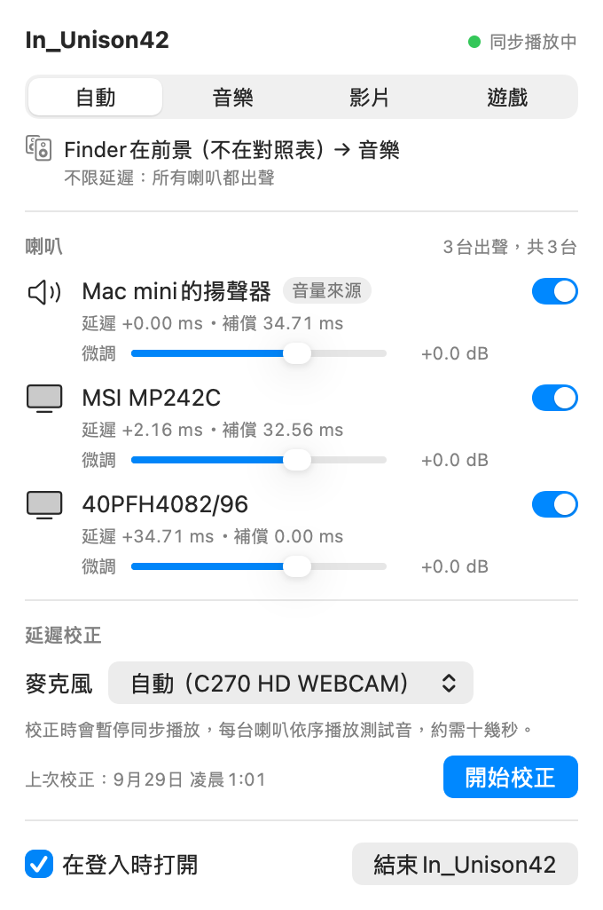

# In_Unison42

**Play every speaker on your Mac at once — in sync, and on a single volume control.**
Part of the **42 series** by [Okle42](https://github.com/Okle42) — follow for more AI tools that actually ship.
A macOS menu bar app: the menu bar volume slider and your keyboard volume keys control **all** of your speakers together, and each speaker's latency is measured with a microphone and compensated so they all play in time.

[繁體中文說明](README.zh-TW.md)

---

macOS's built-in Multi-Output Device can play through several outputs at once, but it has no volume control — and HDMI / DisplayPort monitors have no software volume of their own either.
In_Unison42 installs no audio driver. It uses system frameworks only (CoreAudio / AudioToolbox / Accelerate / Foundation).

> The app's UI and log messages are currently in Traditional Chinese. The names used below (MSI = an HDMI monitor, TV = a DisplayPort TV, C270 = a Logitech USB webcam microphone, GLASS5+ = a Bluetooth speaker) are the devices it was developed and tested with on a Mac mini M4.

## How it works

1. The system default output stays on the built-in speaker (it has hardware volume, so the slider and volume keys keep working as usual).
2. A Core Audio Process Tap (macOS 14.2+) captures all system audio and mutes the original while it does so (excluding itself, to avoid feedback).
3. A private aggregate device: the tap is the input, the built-in speaker is the clock source, and every other physical output (HDMI, DisplayPort, …) has drift correction enabled.
4. IOProc: the built-in speaker gets the original signal (its hardware volume is already applied); every other device is multiplied by the built-in speaker's 10^(dB/20), or 0 when muted.
5. Each speaker has its own delay line (up to 1000 ms — enough for Bluetooth speakers). After microphone calibration, the faster speakers wait for the slower ones so everything lines up.
6. Automatic rebuild on device hot-plug, default-output change, sample-rate change, or a stalled IOProc (500 ms debounce, health check every second, rebuild after the first 2-second stall, backoff retries, at most 6 times per 60 seconds).
7. Output devices that also have a microphone (Bluetooth headsets, USB headsets, conference speakers) are **not** added to the aggregate device: doing so would open their microphone, and the aggregate device would place the mic's input buffer ahead of the tap. The IOProc reads only the buffer the tap is in; if the number of input buffers isn't what it expects, it outputs silence and counts the event.

When the app quits or crashes, the tap goes away with it and audio falls back to the built-in speaker automatically (verified: system audio is fine after `kill -9`).
Multi-Output Devices you created yourself and AirPlay are not used. A Continuity (iPhone) microphone is opened only during calibration, and only if you pick it.

## Install

```sh
./build.sh --install          # build the release version, sign it, and copy it to ~/Applications/In_Unison42.app
open ~/Applications/In_Unison42.app
```

- System frameworks only — nothing else to install. `./build.sh` (without `--install`) just produces `build/In_Unison42.app`, plus `build/In_Unison42`, a symlink to the executable inside the app (for CLI use).
- **Two build flavors** (measured 2026-09-29 on a Mac mini M4):

  | Command | Flavor | Flags | Compile time |
  |---|---|---|---|
  | `./build.sh` | Debug (default) | `-Onone -j10 -D DEBUG -D IU42_DIAG`, includes diagnostic commands | 3.4–4.4 s (4.19 s total by `time`) |
  | `./build.sh --release` | Release | `-O -wmo`, no diagnostics | 25.6–25.9 s |
  | `./build.sh --install` | Release + install | Same as above; `--debug --install` and `--install --no-sign` are rejected | |
  | `./build.sh --install-debug` | Debug + install | Only when you need to run diagnostics on the installed copy | |

  The release build has no `bt-tone-test` / `mic-probe` / `engine-live-test` / `snapshot-live-test` / `output-guard set` (the code isn't compiled in at all),
  `calibrate` accepts only `--pulse` / `--verify-program` / `--mode` / `--only <uid>` / `--mic <uid>` (`--dump`, `--signal`, chirp and so on are refused),
  and `ctl` exposes only what the panel can already do (`snapshot`, `bt attach/detach/simulate-reconnect` and `autocal simulate-appear` are debug-only).
  `In_Unison42 version` prints the build stamp (`git describe --dirty` + time + flavor).
- **Tests**: `./test.sh` (incremental `-O` build into `build/test`) runs 11 offline self-tests in parallel, re-analyzes 15 real recordings with `pp-reanalyze` against `testdata/expected.json` (±0.05 ms),
  and builds a separate copy with release flags to confirm that diagnostic commands and dangerous arguments are blocked (10 checks). Non-zero exit = regression; `--update-expected` regenerates the expected results (only after you deliberately change the measurement).
  Measured 2026-09-29: 18.2 s incremental, 31.8 s cold. The recordings live in `testdata/dump/` (not in version control); `testdata/expected.json` is versioned.
- **Code signing**: ad-hoc (`-`) + Hardened Runtime by default, so no certificate is needed. The trade-off is that you have to re-grant the "System Audio Recording" permission after every rebuild.
  If you have an Apple Development certificate, set `IN_UNISON42_SIGN_IDENTITY="Apple Development: Your Name (TEAMID)" ./build.sh` (find it with `security find-identity -v -p codesigning`) — or put that identity on the first line of `~/.config/in_unison42/sign_identity` so every build picks it up:
  new builds signed with the same identity keep the permission across rebuilds and moves (build/ → ~/Applications).
- On first launch macOS asks for "System Audio Recording" permission; the first calibration asks for "Microphone" permission.
- **Open at login**: tick the box at the bottom of the panel (or `In_Unison42 ctl login-item on`) → registered via `SMAppService.mainApp`. The app must be in `/Applications` or `~/Applications`.
  On first launch, the old LaunchAgent (plist and `bin/`) from earlier versions is moved to the Trash. The old `install` / `start` commands are retired.

## Usage

Menu bar icon (no Dock icon): 🔊 Music, 🎬 Movie, 🎮 Game, ⚠ audio not running, 🔇 not started. Click it to open the control panel:

<picture><source media="(prefers-color-scheme: dark)" srcset="docs/screenshots/panel-live-dark.png"></picture>

There are two kinds of screenshots (all rendered off-screen with ImageRenderer / AppKit — no on-screen windows are touched):

| File | Source | Shows |
|---|---|---|
| `panel-live-{light,dark}.png`, `panel-live-appkit-*.png` | **Real state** (2026-09-29 01:18, `ctl snapshot` from the running app; login item enabled) | Auto → Music, 3 devices playing, latencies written by `calibrate --pulse` |
| `panel-live-game-{light,dark}.png` | **Real state** (after `ctl mode game`) | Locked to Game; the TV shows "silent: latency +34.71 ms exceeds the Game mode limit of 20 ms" |
| `panel-live-guard-{light,dark}.png` | **Real state** (after `output-guard set MSI --yes`; then `ctl guard-restore` switched back to built-in) | Default-output guard warning + "Switch back to 'Mac mini Speakers'" button |
| `panel-live-config-protect-{light,dark}.png` | **Real state** (2026-09-29 15:00, V10: relaunched after writing broken JSON, debug build `ctl snapshot`) | Corrupted-settings warning + "Reset Settings", nothing measured |
| `panel-live-autocal-pending-{light,dark}.png` | **Real state** (2026-09-29 15:02, V9: Cancel pressed after `autocal simulate-appear`) | "Auto-calibration of 〈GLASS5+〉 cancelled" + "Needs calibration" button; GLASS5+ uncalibrated and silent (AppKit render) |
| `panel-drift-{light,dark}.png` | **Mock data** (`render-panel`) | Bluetooth drift compensation (rate, correction, next short calibration) + a "keep default output when Bluetooth connects" event |
| `panel-{light,dark}.png`, `panel-game-*.png`, `panel-appkit-*.png` | **Mock data** (`render-panel`) | iPhone mic option, Bluetooth row (uncalibrated → silent), login item awaiting approval, calibration in progress, and other states that are hard to reproduce on demand |

### Modes: defined by a latency limit

| Mode | Limit (relative to the fastest device) | Result with the latencies measured here |
|---|---|---|
| Music | None | Built-in, MSI and TV all play; compensation 34.46 / 33.20 / 0 ms |
| Movie | 80 ms | Same as above |
| Game | 20 ms | TV (+34.46 ms) is silent; built-in compensated 1.26 ms, MSI 0 |

- Devices over the limit go silent, and compensation is recalculated among the devices still playing. Switching fades out, changes the delays, and fades back in — the aggregate device isn't rebuilt.
- **Auto** (default): follows the frontmost app, with a 1-second debounce. The mapping is `autoModeRules` in `config.json` (bundle id → movie/game/music):
  by default IINA, QuickTime, VLC, Infuse, Netflix, TV and mpv → Movie; Steam, apps whose `LSApplicationCategoryType` is `*games`, and programs in the Steam library → Game; everything else → Music.
- **Manual**: picking Music / Movie / Game locks that mode — it no longer follows the frontmost app until you choose Auto again.
- YouTube / Netflix in a browser still count as Music (only the frontmost app is considered).

### Per device

On/off switch (off = silent), volume trim −12…+6 dB (saved on release; right-click resets to 0 dB), measured latency and current compensation; when a device is silent, the reason is shown.

### Latency calibration

In the panel's "Latency Calibration": pick a microphone → Start Calibration. While it runs, synchronized playback is paused and other apps are muted; each speaker in turn plays pink-noise pulses (1–4 kHz). It takes about 15–40 seconds (with Bluetooth, pulses are 2 seconds apart).
The panel uses the **pulse + GCC-PHAT measurement** (`calibrate --pulse`): for each device it takes the "largest consistent group" (the group with the most pulses inside a 0.3 ms window; on a tie, the earlier group, noted in the output).
A device is written only if at least 3 pulses, and at least half, agree. **If one device fails, only that device is skipped** (its old value is kept) and the others are written; only a failure of the reference speaker (built-in) discards the whole run.
(The chirp-sweep measurement `calibrate` is still available from the CLI; in this room it often locked onto a reflection from the built-in speaker — see [docs/TESTLOG.zh-TW.md](docs/TESTLOG.zh-TW.md) (Chinese).)

**Test signal and what "latency" means**:
- The test signal is **pink noise limited to 1–4 kHz**, 80 ms, −22 dBFS RMS (the old one was white noise 300 Hz–7 kHz at −20 dBFS; this is gentler). Each device other than the reference plays 4 pulses (previously 6).
- **Latency = group delay at 1–4 kHz**: GCC-PHAT uses only 1–4 kHz and takes the peak of the **envelope** (magnitude of the analytic signal), not the carrier peak. These speakers' arrival times differ by 0.6–1.4 ms across frequency bands (dispersion);
  the old measurement used the full-band carrier peak and jumped between a "bass-dominated" and a "treble-dominated" peak. The envelope peak is phase-independent, so it doesn't jump.
- **The test signal ignores system volume**: in the calibration subprocess, HDMI / DP / Bluetooth use a fixed gain of −8 dB (not multiplied by system volume; change it with `--cal-gain-db <dB>`, capped at 0 dB; `off` = old behavior).
  The built-in speaker follows system volume (hardware volume, which this app never touches). Other apps are muted by the tap during measurement, so no program audio suddenly blasts out.
- The old white noise (`--signal noise`) and xylophone (`--signal xylo`, which failed on real hardware — see "木琴測試音評估" (xylophone test-tone evaluation) in [docs/TESTLOG.zh-TW.md](docs/TESTLOG.zh-TW.md) (Chinese)) can still be selected; listening samples are in `docs/tone-samples/` (the G5 version is retired).

- Microphone list: Auto (C270), other physical microphones, iPhone (Continuity — used only for calibration, never opened otherwise). **Bluetooth microphones are never listed, never auto-selected, and refused if specified**
  (opening one would switch the Bluetooth speaker into HFP call quality, and what you'd measure wouldn't be the A2DP latency anyway).
- If the specified microphone isn't present, calibration refuses to run (it never silently falls back to another one).

### Auto-calibration

Hardware acceptance results: "整合驗收" (integration acceptance) V8 / V9 in [docs/TESTLOG.zh-TW.md](docs/TESTLOG.zh-TW.md) (Chinese).

- **A new output device is connected** (never calibrated before): a notification + a "Calibrating 〈device〉 in 3 s" countdown in the panel, which you can Cancel (after cancelling, the panel keeps a "Needs calibration" button).
  When the countdown ends it runs `calibrate --pulse --only <uid>` (measures only the reference speaker + this device and keeps the rest; about 20 s for wired, about 47 s to measure everything).
  **Bluetooth devices that were calibrated before** (reconnect, app relaunch, drift compensation) automatically use the **short measurement**: about 10–11 s (previously 31 s) — see "Bluetooth drift compensation" below.
- **A calibrated wired device is reconnected**: it plays immediately with its previous values; no test tone.
- **A calibrated Bluetooth device actually disconnects and reconnects**: treated like an app relaunch — silent from the moment the stream starts, 3-second countdown, `--only` recalibration;
  if notifications aren't authorized and the panel is closed, the countdown starts when you open the panel (needsConsent). Why: in V8, A2DP latency differed by 35–61 ms each time the stream was reopened.
- **Bluetooth after an app relaunch / launch at login** (previously calibrated): GLASS5+ latency was different after every relaunch (413.6 / 474.8 / 426.3 / 443.5 / 430.5 ms, while kAudioDevicePropertyLatency reported by the system stayed at 111.6 ms and didn't reflect it)
  → it **stays silent** until calibrated, with the same 3-second countdown and automatic recalibration (Bluetooth only).
- If the calibration microphone is busy in another app (a video call, for example) → postponed with a notification, and the countdown restarts once the mic is free; several devices appearing at once → merged into one run; at most one calibration at a time.
- Devices already present at app launch that were never calibrated do **not** automatically play test tones (they just show "Needs calibration"); devices whose auto-calibration failed or was stopped are not retried automatically.
- `ctl autocal status|cancel|now`; rules and wiring in `docs/API.md` §12 (Chinese).
- **Gap in the original audio**: during calibration the app and the calibration subprocess "hand over" the tap (the subprocess prepares the mic, Bluetooth and afplay before letting the app tear its tap down, and as soon as the subprocess removes its tap the app rebuilds — without waiting for analysis and file writes).
  Measured in coreaudiod: no tap at all for 85 ms at the start and 99 ms at the end (the start used to take about 1 second).

### Background listening: fixing drift while music plays

Rules and API in [docs/API.md](docs/API.md) §13 (Chinese).

- Panel switch "Auto-fix drift while playing music" (**on by default**). In Music mode with program audio playing, every 5 minutes it listens for 10 seconds through the calibration mic (C270),
  using the music itself as the reference (1–4 kHz GCC-PHAT). In turn it adds a +3 / +4 ms probe offset (0.5 s ramp) to Bluetooth (every round) and to one wired device (every 3 rounds),
  and measures that device's error relative to the wired devices; only after 2 consistent results (confirmed 30 s later) does it correct, at a slope of ≤ 0.1 ms/s. > 10 ms, > 50 ms cumulative, or 3 consecutive misses after having measured before → it doesn't fix it itself and flags "Needs calibration".
  ("Can't measure → needs recalibration" means **it has produced at least one trustworthy measurement since calibration, followed by 3 consecutive misses**.)
  When a Bluetooth device already has a drift model, trustworthy listening results become one data point of that model (no separate correction stacked on top) — see the next section.
- The round is skipped if the mic is busy in another app, the program audio is too quiet or has too little 1–4 kHz energy, or a calibration is running.
- **Privacy**:
  - Recordings are **processed in the app's memory only and discarded immediately — never saved, never uploaded**; the log contains only statistics (dBFS, SNR, error in ms), no audio content.
  - During the 10 seconds of listening macOS shows the **orange microphone indicator** (once every 5 minutes).
  - **You can turn it off**: the panel switch or `ctl monitor off`; once off, the mic is never opened. It never opens a Bluetooth speaker's microphone.
- Menu bar icon: when any device is waiting for calibration (needs calibration, waiting for you to open the panel to count down, flagged by background listening, Bluetooth paused until calibrated), a dot appears at the top right; the panel then shows a "Needs calibration" banner with "Calibrate Now".
- ⚠ **Hardware result: in this room (system volume 38, C270 next to GLASS5+, wired speakers far from the mic) the algorithm judged every round "not trustworthy"**, so it never corrected anything
  (safety holds; the feature itself hasn't been proven on real hardware). See "第 B 輪整合驗收" (round B integration acceptance) in [docs/TESTLOG.zh-TW.md](docs/TESTLOG.zh-TW.md) (Chinese).

### Bluetooth drift compensation

Rules and API in [docs/API.md](docs/API.md) §14 (Chinese).

A Bluetooth speaker's (GLASS5+) latency slowly drifts within a single stream (measured at about −0.78 ms/min — the speaker's own DAC clock / A2DP buffer, which resampling on our side can't absorb).
- **Predictive compensation**: every measurement within one stream (Bluetooth-only calibrations, `--verify-program`, trustworthy background-listening results) → weighted linear regression estimates the drift rate;
  correction = **latest measured value** + rate × elapsed time (right after a measurement it equals the measured value; background-listening points have 2–4 ms error, so they only help estimate the rate and never decide the correction on their own).
  Every 10 seconds the correction is handed to the delay adjustment (a slow slope of ≤ 0.1 ms/s, inaudible). When the stream restarts (reconnect, app relaunch, …) it starts over, and the old stream's correction is cleared.
  A rate beyond ±3 ms/min or contradictory measurements → no extrapolation, flagged "Needs calibration".
- **Prediction miss**: a new measurement differs from the prediction at that moment by > 3 ms (the Bluetooth threshold) = the compensation has exceeded the threshold; the panel shows "last … prediction miss".
  **2 in a row → "irregular drift"**: no extrapolation (the correction stays at the latest measurement), flagged "Needs calibration".
- **Short calibration** (about 10–11 s, previously 31 s): when measuring Bluetooth only (`--pulse --only <bluetooth>`) it automatically uses the short measurement: reference ×2, Bluetooth ×4, reference ×2, 0.9 s apart,
  with a search window of ±150 ms around the previous latency, and the pilot tone (150 Hz, −40 dBFS) overlapping the setup time. If nothing is found (e.g. the latency jumped too far after a reconnect) → it falls back to the full measurement automatically.
- **Scheduling**: the 2nd point is measured about 5 minutes after the stream starts (to estimate the rate); after that it measures again whenever the predicted error may exceed 2 ms. GLASS5+'s drift rate changes, so **with the current parameters this is about every 5 minutes in practice**
  (the 30-minute upper bound only applies to speakers with a very stable rate). **It prefers pauses in the music** (program audio silent continuously for 5 s – 10 min, after at least 20 s of continuous playback,
  system not muted and volume > −40 dB) and runs right away without interrupting anything; only after 30 minutes of continuous playback with no pause does it count down 3 seconds (if notifications aren't authorized → the countdown starts when you open the panel).
  If it hasn't measured for too long (predicted 2σ error > 4 ms, about 7 minutes) → the correction is frozen instead of extrapolating the old rate. 3 consecutive misses → flagged "Needs calibration" and **automatic short calibration stops** (it resumes once a manual calibration succeeds).
- ⚠ **Current limitation (to be honest)**: this compensation only holds when there is a measurement roughly every 5 minutes (D2: residual < 2 ms). **When tracks play back to back with no pause of 5 seconds or more,
  the "count down only after 30 minutes" rule means the correction freezes about 7 minutes after a measurement, and over the next 20-odd minutes the error grows with GLASS5+'s drift to somewhere between ten-odd and twenty-odd ms**.
  In the hardware acceptance run (measurements 10–18 minutes apart), all 3 residuals — +4.1 / −9.2 / −12.5 ms — exceeded 3 ms. In addition, late in that run GLASS5+ showed **step jumps of about 17 ms**
  (within one 4-second measurement, the first two pulses at 436.7 ms and the last two at 419.4 / 421.6 ms), which no prediction can compensate. Whether to change the rule: see "第 C 輪留給 Kang 決定" (round C, left for Kang to decide) in [docs/ROADMAP.md](docs/ROADMAP.md) (Chinese).
- Panel switch "Bluetooth drift compensation" (on by default) + per device: drift rate, current correction, prediction misses, next short calibration. `ctl drift status` (includes the last 6 Bluetooth residuals).

### Other

- **System alert sounds play only from the built-in speaker**: at launch the "Play sound effects through" output is set to built-in, and `systemsoundserverd` is excluded from the tap (so it isn't muted and isn't sent to the other speakers):
  on macOS 26+ via `CATapDescription.bundleIDs` + `processRestoreEnabled` (excluded automatically even after it's reaped when idle and restarts with a new pid), and the current process object is still excluded as before;
  this is set up before the first tap is created.
- **Corrupted-settings protection**: if `config.json` can't be read, the broken file is kept as `config.json.corrupt-<time>` and a `config.json.protect` flag is written; the app runs on defaults but **never saves automatically**
  (so defaults never overwrite your calibration results). The panel shows a warning at the top + a "Reset Settings" button (`docs/screenshots/panel-live-config-protect-*.png`, real state).
  The protection lifts on a successful calibration, "Reset Settings", `ctl config reset`, or putting a good settings file back (`ctl reload-config`). Check with `In_Unison42 config status` / `ctl config status`.
- **Default-output guard**: when the default output is switched to a device with no volume (HDMI / DP), the panel shows a notice with a "Switch back to 'Mac mini Speakers'" button; it changes only the default output, never the volume.
- **Bluetooth speakers**: not added to the aggregate device; a separate output-only IOProc reads from the program-audio ring buffer and uses adaptive resampling to absorb clock drift. **Their input is never opened** (to avoid being switched to HFP call quality).
  - The read position is locked to a "fixed target delay": recomputed every cycle from timestamps (Bluetooth output time − compensation − a fixed 30 ms buffer); the PI / feed-forward loop only absorbs the clock ratio, so the latency doesn't drift over time.
  - Calibration: `calibrate --pulse` ("Start Calibration" in the panel) opens Bluetooth output in its own subprocess and measures it together with the rest; unmeasured Bluetooth devices play "uncompensated" during measurement, solo pulses are spaced 2 seconds apart,
    and each Bluetooth device's arrival time is first found by coherently stacking 6 pulses in a wide (900 ms) window. **If the mic can't hear the Bluetooth speaker, only Bluetooth is skipped** (it stays uncalibrated = silent) and the other speakers are written as usual.
  - Playback rules: once a Bluetooth device's latency is measured → it plays in Music mode (the other speakers wait for it); the Movie 80 ms / Game 20 ms limits still apply (A2DP is usually > 80 ms → automatically silent).
  - Reconnect: a measured Bluetooth device that disconnects and reconnects (or `ctl bt simulate-reconnect` in the debug build) → **treated like an app relaunch**: before restarting, the engine holds it (muted from the moment the stream starts),
    counts down 3 seconds and recalibrates with `--only` (if notifications aren't authorized → the countdown starts when you open the panel). The old policy (keep playing with the old values) was overturned by V8: A2DP latency differed by 35–61 ms each time the stream was reopened.
    A **real disconnect/reconnect was tested** on 2026-09-29 17:55 (IOBluetooth `closeConnection` / `openConnection`; see "第 B 輪審查修正" (round B review fixes) in [docs/TESTLOG.zh-TW.md](docs/TESTLOG.zh-TW.md) (Chinese)).
    The **first** connection (a device this app process has never started, e.g. one that connects 30 seconds after launch) is also held before it starts (avoiding a gap of about 1 second where it played with old values);
    within 30 seconds of launch it's treated as an app relaunch, after that as a reconnect — either way it counts down and recalibrates.
    Note: when a Bluetooth device reconnects, macOS **switches the system default output to it** (it happened both times in testing). So a switch like this within **10 seconds** of a Bluetooth connection is **switched back automatically** to the volume source (built-in),
    and an entry is recorded in the log and in the panel under "Keep default output when Bluetooth connects" (switch on by default). If you later choose the Bluetooth device as default output yourself → that's respected, with just the usual warning + "Switch back" button. It only changes the default output, never the volume.
    This applies only to **Bluetooth speakers this app is playing through**: Bluetooth devices on the exclusion list or switched off (e.g. excluded AirPods) are always left alone, and a Bluetooth device that was already connected and is manually selected as default output is not treated as "just connected".

## CLI (the app's executable with a subcommand)

```sh
B=~/Applications/In_Unison42.app/Contents/MacOS/In_Unison42    # or ./build/In_Unison42
$B devices | mics | status | help
$B ctl state                          # control the running app: state / mode auto|music|movie|game / snapshot <dir> /
$B ctl mode game                      #   guard-restore / calibrate [args] / peaks <seconds> / bt … / login-item …
$B ctl calibrate --verify-program --mode game --check-silent
$B ctl bt status                      # Bluetooth: sample rate, fixed buffer, underruns, re-timing, resampling correction ppm, fill level, playback plan
$B ctl bt simulate-reconnect <uid>    # simulate a Bluetooth disconnect/reconnect (debug build; silent first, countdown, --only recalibration)
$B ctl monitor status|on|off          # background listening: status (last round, per-device error, cumulative correction, mic DeviceIsRunningSomewhere) / panel switch
                                      #   debug build: monitor now (run a round in the next second) | bias <uid> <ms> | bias clear | interval <seconds>; autocal set-latency <uid> <ms>
$B ctl autocal status|cancel|now      # auto-calibration: status / cancel countdown / calibrate "Needs calibration" devices now
$B ctl drift status|on|off            # Bluetooth drift compensation: model (points, rate, prediction ± σ), next short calibration, last trigger (pause / countdown); panel switch
$B ctl drift verify-feed on|off       #   for acceptance testing: whether --verify-program results become model points (runtime)
$B ctl output-restore status|on|off   # macOS grabs the default output within 10 s of a Bluetooth connection → switch back automatically: status / panel switch
$B ctl config status|reset            # read-only protection status of the settings file / reset to defaults (same as "Reset Settings" in the panel)
$B version                            # build stamp (git describe + time + debug/release)
$B ctl trim <uid> <dB>                # same as the panel's volume trim; ctl reload-config: reload after editing config.json externally
$B render-panel docs/screenshots      # mock-data panel screenshots (off-screen)
```

- Commands that need audio permissions (`calibrate`, `mic-probe`, `engine-live-test`) must run as the app: use `ctl calibrate …` while the app is running,
  or, when it isn't, `open -W -n --stdout /tmp/x.log ~/Applications/In_Unison42.app --args <command>`. Run straight from the terminal, the permissions are attributed to the terminal.
- `run` (foreground CLI engine) still works; only one tap instance (app or run) can exist at a time — two would mute each other.

### Calibration commands

```sh
$B calibrate [--mic <uid|name|auto>] [--mode music|movie|game]   # measure latency and write measuredLatencyMs
$B calibrate --pulse [--mic …]          # measure with pulse + GCC-PHAT and write (what the panel uses; default Music mode = every enabled device)
$B calibrate --verify                   # verify only (devices playing in the current mode); exits 0 if residual < 1 ms
$B calibrate --pulse --only <bluetooth> # Bluetooth only (if calibrated before → short measurement, about 10–11 s; --full forces the full one)
$B calibrate --verify-program --only <bluetooth>   # Bluetooth-only verification (short, no write): measured latency vs. what the app is using (calibration + correction) → residual, threshold 3 ms
$B calibrate --verify-program [--check-silent]   # independent measurement: afplay → tap → delay line → each speaker, GCC-PHAT; thresholds: 1 ms between wired, 3 ms for Bluetooth
                                        #   (toleranceExternalMs: Bluetooth's arrival difference to any device and its own pulse spread; wired toleranceMs stays 1 ms)
                                        #   --check-silent also solos the silent devices and uses a matched filter to prove they really are silent
$B calibrate --volume-test              # whether volume / mute control every playing speaker together (only turns down, restores at the end)
$B snapshot-live-test                   # hardware check that "restore only lowers and never overrides what the user did in the meantime" (briefly lowers volume / switches default output, then restores)
$B calibrate --selftest                 # synthetic self-test, silent (includes the program-path measurement: xylophone / noise, Bluetooth A2DP simulation, largest consistent group)
$B monitor-selftest [--quick]           # offline self-test of the background-listening algorithm (debug build; pure computation, no mic); monitor-sim: a single simulation
                                        # note: when the app runs --verify-program via ctl, it hands its background-listening correction to the subprocess (so what's verified is the compensation actually playing)
$B calibrate --verify-program --signal ab-pink   # interleave pink (new) and white noise (old) in one recording for comparison (ab = xylophone vs. white noise; verify only, no write)
$B pp-signal pink|noise|xylo|xylo-strong out.wav # write a test signal to WAV (for listening)
#   --pulse / --verify-program / --volume-test include Bluetooth by default; --no-bluetooth leaves it out;
#   --bt-uncalibrated (for hardware testing, off by default): uncalibrated Bluetooth plays "uncompensated" during verification
#   --signal pink|noise|xylo|xylo-strong|ab|ab-strong|ab-pink: test signal (default pink); --cal-gain-db <dB|off>: fixed test-signal gain for HDMI / DP / Bluetooth (default −8); --signal-for <uid|name>=<signal>: change the signal for that device only
#   --dump <dir>: save recordings and metadata so `pp-reanalyze <dir>` can re-analyze them offline later (for tuning)
```

`--verify-program` deliberately uses a different measurement from `calibrate` / `--verify`: the test sound is played by another process (`afplay`) and takes the same path as normal program audio;
the signal is pink-noise pulses at 1–4 kHz (not a sweep); arrival time is the envelope peak of 1–4 kHz GCC-PHAT; the time axis uses only the microphone's own clock; only one device plays at a time, and other apps are muted by a separate tap during measurement.

- Log: `~/Library/Logs/In_Unison42.log`; state: `~/Library/Application Support/In_Unison42/state.json`; settings: `config.json` in the same folder (version 2).
- Only one tap instance at a time: `~/Library/Application Support/In_Unison42/instance.lock` (flock). A second app instance waits (with a notice in the panel) and takes over within 1 second after the first one quits;
  running `calibrate` / `run` straight from the terminal is blocked while the app is running (use `ctl calibrate …`).
- Self-tests: `plan-selftest`, `mode-selftest`, `engine-selftest`, `reconnect-selftest`, `service-selftest`, `bluetooth-selftest`, `panel-snapshot --selftest`, `calibrate --selftest`.

## Limitations

- Requires macOS 14.2 or later (Process Tap).
- During display sleep (`pmset displaysleepnow`, 8 s and 60 s) the HDMI / DP audio devices do **not** disappear, so no rebuild is triggered. **Physically unplugging the display cable and full system sleep (`pmset sleepnow`) haven't been tested yet**; the rebuild and wake paths are only verified in virtual-time simulation (wake detected within ≤ 1 s, forced rebuild if IO hasn't advanced 1 s after wake, rebuild after a 2 s IO stall).
- When the default output is switched to a device without volume (HDMI / DP, "All Speakers"), the volume source is still the built-in speaker, so the volume keys / menu bar slider control no speaker at all (macOS simply has no volume for HDMI). The panel shows a notice with a one-click switch back; it never switches automatically.
- When the default output is switched to "another output with hardware volume", the volume source should follow: this path has **only a self-test** and hasn't been tested on hardware (no USB DAC / USB headphones — a device with volume but no mic — on hand).
- **Wired** output devices that also have a microphone (USB headsets) don't join in (see How it works, item 7). Bluetooth speakers use the output-only path: verified on hardware not to trigger HFP, 0 underruns over 3 minutes of resampling (at gain 0).
  **GLASS5+ is calibrated, and all four devices play in Music mode** (an app relaunch automatically triggers `--only` recalibration, because latency differs by 35–61 ms after a relaunch).
  The Bluetooth verification threshold is **3 ms** (1 ms between wired devices): V7 passed 3 times in a row (Bluetooth difference 0.81 / 1.53 / 2.17 ms), but **Bluetooth latency drifts in one direction within a stream** (V7: 1.4 ms in 1.5 minutes),
  so at that rate it exceeds 3 ms within a few minutes — **"Bluetooth within 3 ms" only holds shortly after calibration**; there is currently no periodic re-measurement, and the PI loop doesn't use measured latency (pending Kang's decision).
  (Older record: with a 1 ms threshold, 4 of 6 runs passed between 13:32 and 13:41.) Long-term resampling while Bluetooth is playing, and latency before vs. after a **real disconnect/reconnect**, haven't been measured yet.
- The login item (SMAppService) is registered, but log-out/log-in and restart have **not** been tested. **The app doesn't restart itself after a crash** (`SMAppService.mainApp` has no KeepAlive; the old LaunchAgent did):
  on a crash the tap disappears with the process and audio falls back to the built-in speaker, so you have to reopen the app manually. Automatic recovery would need a separate design (e.g. an `SMAppService.agent` watchdog), which isn't done.
- The xylophone C5 tone doesn't measure accurately in this room (see "木琴測試音評估" (xylophone test-tone evaluation) in [docs/TESTLOG.zh-TW.md](docs/TESTLOG.zh-TW.md) (Chinese)), so the test signal is pink noise.
- Speaker arrival time varies by 0.6–1.4 ms across frequency bands (MSI, TV): "latency" is defined as the 1–4 kHz group delay, and the bass and treble really are offset by that much (a property of the speakers; compensation can only target one band).
- Chirp calibration (`calibrate`) is unreliable in this room: a +4 ms reflection from the built-in speaker is almost as strong as the direct sound and the TV's SNR is about 6 dB, so all 4 writes failed; the panel uses the pulse measurement (`--pulse`) instead.
- When replacing an old app version (without the instance lock) with a new one directly, the old version won't step aside: quit the old one before opening the new one (`build.sh --install` doesn't stop the running app).
- Mode-switch fades have only been tested on offline waveforms, not with recordings or by ear.
- If system alert sounds are played by a process other than `systemsoundserverd` (e.g. if a future version moves them to audiomxd), they won't be excluded.
- Latency compensation is a single value per device; room echo and speaker group delay can only be checked with `--verify`.
- Occasionally, in the first second after launch, the HAL drops one IO cycle (`skip=1` in the log); the skipped frames are added back to the timeline, so calibration isn't affected.
- Without permission the IOProc doesn't run, and automatic rebuilds back off at 2, 4, 8 … seconds (up to 300 s); after you grant permission it recovers on its own within about 5 minutes, or just `stop` and `start`.

Code structure and internal API: [docs/API.md](docs/API.md) (Chinese). Hardware acceptance log from development: [docs/TESTLOG.zh-TW.md](docs/TESTLOG.zh-TW.md) (Chinese).

## Roadmap

See [docs/ROADMAP.md](docs/ROADMAP.md) (Chinese). Looking for someone with AirPlay hardware to take on AirPlay output.
